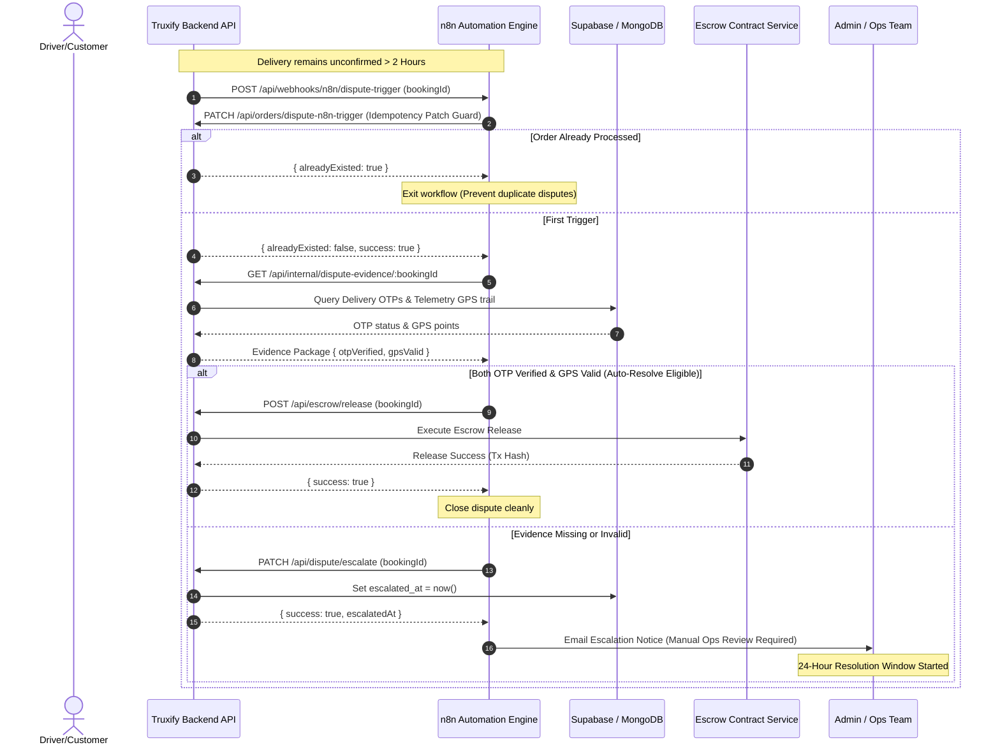

# Dispute Resolution Pipeline Sequence Diagram

```mermaid
sequenceDiagram
    autonumber
    actor Driver/Customer
    participant Backend as Truxify Backend API
    participant n8n as n8n Automation Engine
    participant DB as Supabase / MongoDB
    participant Escrow as Escrow Contract Service
    participant Admin as Admin / Ops Team

    Note over Backend, n8n: Delivery remains unconfirmed > 2 Hours
    Backend->>n8n: POST /api/webhooks/n8n/dispute-trigger (bookingId)
    n8n->>Backend: PATCH /api/orders/dispute-n8n-trigger (Idempotency Patch Guard)
    
    alt Order Already Processed
        Backend-->>n8n: { alreadyExisted: true }
        Note over n8n: Exit workflow (Prevent duplicate disputes)
    else First Trigger
        Backend-->>n8n: { alreadyExisted: false, success: true }
        n8n->>Backend: GET /api/internal/dispute-evidence/:bookingId
        Backend->>DB: Query Delivery OTPs & Telemetry GPS trail
        DB-->>Backend: OTP status & GPS points
        Backend-->>n8n: Evidence Package { otpVerified, gpsValid }

        alt Both OTP Verified & GPS Valid (Auto-Resolve Eligible)
            n8n->>Backend: POST /api/escrow/release (bookingId)
            Backend->>Escrow: Execute Escrow Release
            Escrow-->>Backend: Release Success (Tx Hash)
            Backend-->>n8n: { success: true }
            Note over n8n: Close dispute cleanly
        else Evidence Missing or Invalid
            n8n->>Backend: PATCH /api/dispute/escalate (bookingId)
            Backend->>DB: Set escalated_at = now()
            Backend-->>n8n: { success: true, escalatedAt }
            n8n->>Admin: Email Escalation Notice (Manual Ops Review Required)
            Note over Admin: 24-Hour Resolution Window Started
        end
    end
```
