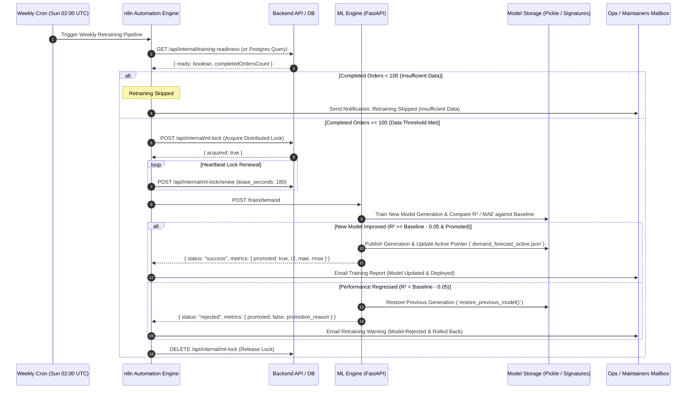

# ML Model Retraining Pipeline Sequence Diagram

```mermaid
sequenceDiagram
    autonumber
    participant Cron as Weekly Cron (Sun 02:00 UTC)
    participant n8n as n8n Automation Engine
    participant Backend as Backend API / DB
    participant MLEngine as ML Engine (FastAPI)
    participant Storage as Model Storage (Pickle / Signatures)
    participant Ops as Ops / Maintainers Mailbox

    Cron->>n8n: Trigger Weekly Retraining Pipeline
    n8n->>Backend: GET /api/internal/training-readiness (or Postgres Query)
    Backend-->>n8n: { ready: boolean, completedOrdersCount }

    alt Completed Orders < 100 (Insufficient Data)
        Note over n8n: Retraining Skipped
        n8n->>Ops: Send Notification: Retraining Skipped (Insufficient Data)
    else Completed Orders >= 100 (Data Threshold Met)
        n8n->>Backend: POST /api/internal/ml-lock (Acquire Distributed Lock)
        Backend-->>n8n: { acquired: true }

        loop Heartbeat Lock Renewal
            n8n->>Backend: POST /api/internal/ml-lock/renew (lease_seconds: 180)
        end

        n8n->>MLEngine: POST /train/demand
        MLEngine->>Storage: Train New Model Generation & Compare R² / MAE against Baseline

        alt New Model Improved (R² >= Baseline - 0.05 & Promoted)
            MLEngine->>Storage: Publish Generation & Update Active Pointer (`demand_forecast_active.json`)
            MLEngine-->>n8n: { status: "success", metrics: { promoted: true, r2, mae, rmse } }
            n8n->>Ops: Email Training Report (Model Updated & Deployed)
        else Performance Regressed (R² < Baseline - 0.05)
            MLEngine->>Storage: Restore Previous Generation (`restore_previous_model()`)
            MLEngine-->>n8n: { status: "rejected", metrics: { promoted: false, promotion_reason } }
            n8n->>Ops: Email Retraining Warning (Model Rejected & Rolled Back)
        end

        n8n->>Backend: DELETE /api/internal/ml-lock (Release Lock)
    end
```
